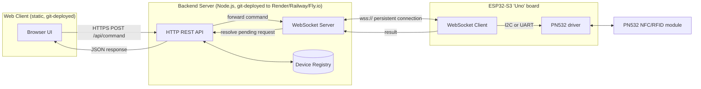

# Architecture — ESP32-S3 + PN532 + WebSocket backend + HTTP client

## Overview

**Why this shape:** the ESP32 is behind a router/NAT with no public IP, so the backend can't call it directly. Instead the ESP32 dials *out* to the backend and holds the WebSocket connection open. The backend then acts as a switchboard: it takes a plain HTTP request from the browser, forwards it down the matching WebSocket connection to the right device, waits for the device's reply, and hands that reply back as a normal HTTP response. The browser never has to speak WebSocket at all.

## Request lifecycle

1. **ESP32 boots** → connects to Wi‑Fi → opens `wss://your-backend/esp32?deviceId=esp32-01&token=...` → backend registers it in the device map.
2. **Browser** sends `POST /api/command` with `{ "deviceId": "esp32-01", "command": "read_tag" }`.
3. **Backend** generates a `requestId`, stores a pending Promise keyed by it, and sends `{ requestId, command, params }` down the ESP32's WebSocket.
4. **ESP32** parses the JSON, talks to the PN532 over I2C or UART, and sends `{ requestId, status, ...data }` back.
5. **Backend** matches `requestId` to the pending Promise, resolves it, and the original HTTP response returns to the browser (with a timeout if the device never answers).

## Two transports to the PN532

| | I2C | UART (HSU) |
|---|---|---|
| Wires | SDA, SCL (+ optional IRQ, RESET) | TX→RX, RX→TX (+ RESET) |
| PN532 board switches | SEL0=0 (I2C mode, off/off usually) | SEL1=1, SEL0=0 (HSU mode — check silkscreen) |
| ESP32-S3 side | `Wire.begin(sda, scl)` | `Serial1.begin(115200, SERIAL_8N1, rx, tx)` |
| Arduino library | `Adafruit_PN532` | `PN532` + `PN532_HSU` (Elechouse/Seeed fork) |
| Pros | Fewer pins, easy to share bus | Frees I2C bus, longer reliable cable runs |
| Cons | Adafruit's own I2C note: works but avoid sharing the bus with other slow devices | Ties up a hardware UART pair |

Most PN532 breakout boards (the common red ones) have two slide/DIP switches on the edge that select SPI / I2C / HSU — set them to match whichever `.ino` you flash. Both wiring diagrams are in the firmware files themselves.

## Deployment path (the "git deploy" pieces)

- **Backend** → push `backend/` to a Git repo → connect it to Render/Railway/Fly.io → they build with `npm install` and run `npm start` → you get a stable `wss://...` / `https://...` URL.
- **Client** → push `client/` to a Git repo → connect it to Netlify/Vercel/GitHub Pages as a static site (no build step) → you get a `https://...` URL the browser opens.
- **ESP32 firmware** is flashed locally from the Arduino IDE/CLI — it's not "deployed via git" the same way, it just needs the backend's URL baked into `secrets.h`.

See `README.md` for exact deploy steps.
